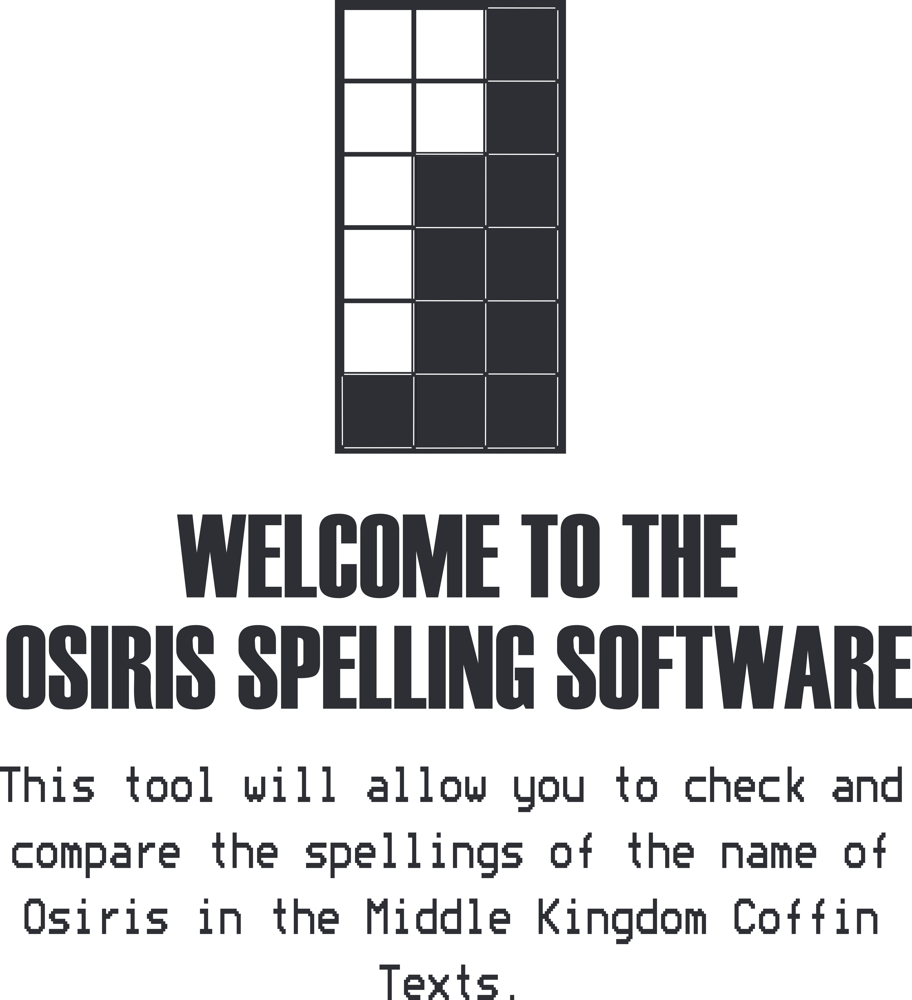
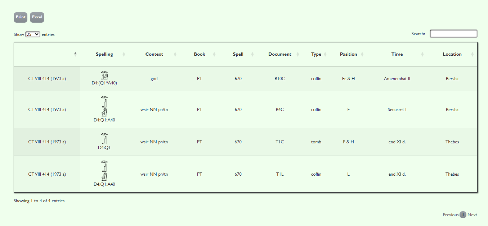
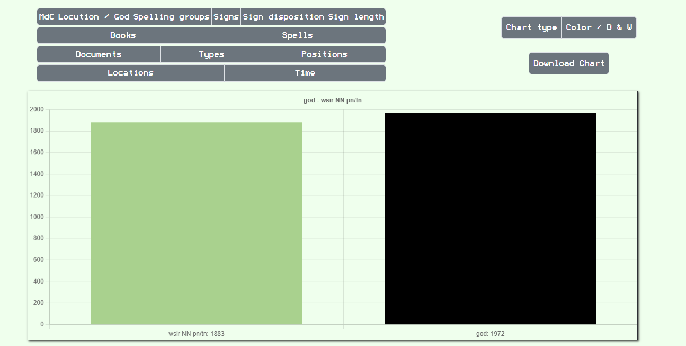

# Osiris Spelling Software



## Description

This web application is designed to check and compare every spelling of the name of Osiris from the Middle Kingdom Coffin Texts.

It is based on the Coffin Texts collected in the volumes of Adriaan de Buck (1935-1961) and James P. Allen (2006). The spellings have been registered by hand, so it is possible that it contains some minor error. Double-checking the results obtained is recommended. As a continuation of the studies of the variability of the spellings used in the name of Osiris in this corpus, I decided to introduce these spellings in a database that would serve as the basis for the present Web Application. Osiris Spelling Software allows you to perform complex queries against the aforementioned database and display the data filtered by specified conditions. These conditions are based on the different characteristics that can be deduced from every spelling:

If it is the name of the god or the locution wsir NN pn/tn (used to refer to the deceased).
Type of spelling (according to Manuel de Codage).
Spell.
Document (coffin, tombs, canoptic jars, fragments...).
Time.
Location.
(Other characteristics based on these have been taken into account, such as the position in each document or the number of signs in every spelling)

The data will be displayed in a table that can be ordered at will and on which quick searches can be made. They will also be displayed on charts, based on the number of times each feature is repeated. This makes it easy to compare large amounts of data at a glance.




## Instalation

The application is currently deployed using a free hosting service called _000WebHost_, and it can be accessed through [this link](https://osirisspellingsoftware.000webhostapp.com/src/index.html).

In case the server is not available, you should follow the instructions below.

##### _Technical Requirements:_

_Hardware:_

- 250 MB of hard disk space.
- Pentium processor or higher.
- Compatible with Windows, macOS, and Linux.

_Software:_

- Docker Compose (for Linux). _We recommend version 2.20.0 or higher_.
- XAMPP (for Windows or macOS). _We recommend version 8.2.0 or higher_.

##### _Installation steps:_

__*Linux:*__

1. Navigate to the project folder (where the _docker-compose.yml_ and _Dockerfile_ are located) and execute the following command:

```bash
docker-compose up -d
```
2. Access the phpMyAdmin interface via this URL: http://localhost:8000/.
```bash
Server:
Username: root
Password: root
```
3. Import the script from /OsirisSpellingSoftware/db/osiris.sql into a database named __"osiris"__.
4. Access the page through the server using this URL: http://localhost:8080/src/index.html.

__*Windows and macOS:*__
1. Start Apache and MySQL using XAMPP.
2. Access phpMyAdmin through the XAMPP admin panel.
3. Import the script from /OsirisSpellingSoftware/db/osiris.sql into a database named "osiris".
4. Place the contents of the /OsirisSpellingSoftware folder in the root of the Apache server.
5. Access the application through the browser using the following URL: _*root path*_/src/index.html.


## Use

- The navbar buttons only show informational views.
- To show all the spellings recorded in the database click on the "all" button in the left side bar.
- To search by reference click on the "len" button in the left side bar, introduce reference and click on "search".
- To filter results click on the "filter" button in the left side bar, enter the desired options and click on "filter".
- In the table views, click on rows to see the result. Click on print and Excel to print and download the table. Use the options in the table to filter and sort.
- In the charts view, check the different data types in the left-side buttons. Change the chart style and donwload the chart in the right-side buttons.


## About me

My name is Cesar Guerra Mendez and I'm an Egyptologist and fullstack web developer. This is currently my most ambitious work, in which I want to show that my two careers are not only compatible, but can benefit from each other.

🖥  Currently working on SoftwareOne.<br>
🤝 Collaborating with [MORTEXVAR](https://www.mortexvar.com/).<br>
🗣️ English, Spanish, Galician, Portuguese.<br>


Check my [Github](https://github.com/csrgrr) to see more projects and my [Academia.edu](https://liverpool.academia.edu/C%C3%A9sarGuerraM%C3%A9ndez) to check my research.

Email: guerramendezcesar@gmail.com

## License

I am committed to open research and have chosen the Creative Commons license for my content. This license allows others to use and share my work, but prohibits commercial derivative works. I believe in freely accessible knowledge and invite collaboration within our community. Join me in shaping a future of open ideas and innovation for all.

[Osiris Spelling Software by César Guerra Méndez distributed under a Creative Commons Atribution-NoCnomercial 4.0 International Licence](https://creativecommons.org/licenses/by-nc/4.0/)
[Check the license](./LICENSE).


## Contributing:

- Fork: Clone a copy of the project's repository to your GitHub account.

- Clone: Clone your forked repository to your local machine using Git.

- Branch: Create a new branch for your contribution.

- Make Changes: Make and commit your code changes in the new branch.

- Sync: Regularly update your fork with the latest changes from the original repository.

- Push: Push your changes to your fork on GitHub.

- Pull Request: Open a pull request from your branch to the original repository.

- Feedback: Address feedback and make changes as needed.

- Approval: Once approved, your changes will be merged into the project.

Remember to follow project guidelines and enjoy contributing!


## Memory

1. [Preliminar studies](doc/templates/1_estudo_preliminar.md)
2. [Discuss: System Requirements](doc/templates/2_analise.md)
3. [Design](doc/templates/3_deseno.md)
4. [Codification and tests](doc/templates/4_codificacion_probas.md)
5. [Manuals](doc/templates/5_manuais.md)

#### AAnnexes
1. [References](doc/templates/a1_referencias.md)
2. [Planification](doc/templates/a2_planificacion.md)
3. [Budget](doc/templates/a3_orzamento.md)
