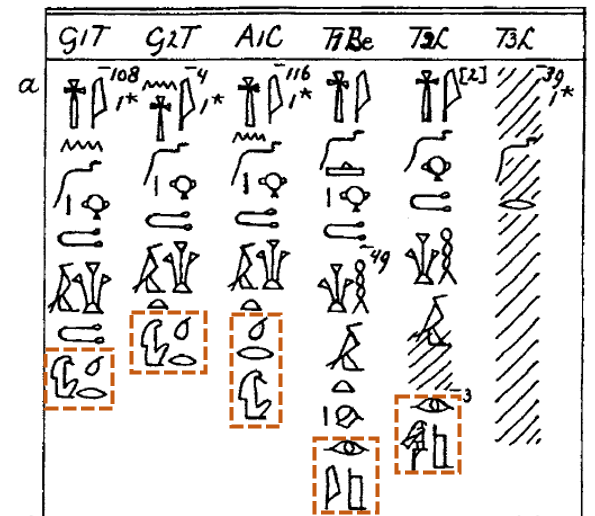
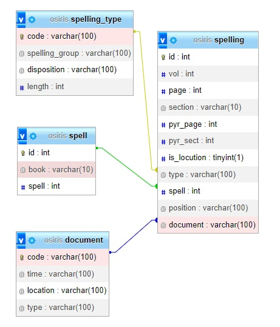

# Estudo preliminar
_César Guerra Méndez_

 

## 1. Introdución
 

### Antecedentes:

Como parte del Proyecto [OCR-PT-CT](https://www.mortexvar.com/ocr-pt-ct), realicé una tabla de grafías del nombre de Osiris (formas en las que el nombre del dios Osiris puede presentarse, en este caso, en los sarcófagos del Reino Medio Egipcio). El objetivo era que una _OCR_ (Optical Character Recognition software)[^1], provista de una Inteligencia Artificial, fuera capaz de leer estos textos, distinguir los nombres de Osiris y proporcionar una  referencia de su posición.

  _Tabla de grafías del nombre de Osiris, recogidas a partir de los volúmenes de de Buck y Allen. Incluye todas las formas descubiertas en los Ataúdes del Reino Medio hasta la fecha._

  

  _Sección de ejemplo de los documentos de de Buck y Allen. En esta página están señalados varios nombres de Osiris con diferentes grafías. Se pretende que la OCR reconozca dichos nombres como grupos y produzca su código de acuerdo al MdC (Manuel de Codage), los reconozca como "Osiris" (wsir en transliteración), les asigne un código de localización (en este caso sería CT III 307 a [tomo 3, página 307, sección a]) y un documento (el código que aparece en la linea superor [G1T -> Gebelein necropolis, coffin 1])._

Más allá de la OCR, el estudio clarificó unas dudas dentro del campo de la lingüística egipcia y se desarrolló para incorporarlo en el capítulo de un libro (en proceso de publicación) y una [conferencia](https://www.mortexvar.com/conference). Finalmente, dado que la OCR no fue todavía capaz de obtener todas las referencias de forma fiable, registré todas ellas a mano en un documento EXCEL diferenciando entre si la palabra Osiris se refiere al dios o un difunto[^2] (un total de 3856 referencias) para su posterior publicación.

La elaboración de este documento ha sido asistida por la [MORTEXVAR database](https://www.mortexvar.com/database), que permite obtener referencias de texto de los siete primeros volúmenes de texto mediante una búsqueda (el volúmen 8 no se incluye y tuve que buscar cada posición a mano).

 

### Conceptualización del proyecto:

El estudio de las grafías de Osiris, en materia de etimología, ha sido materia de discusión desde los autores clásicos, como Plutarco[^3]. Los académicos han intentado resolver el significado del nombre de este dios a partir de los signos jeroglíficos que lo componen y como han ido variando a lo largo de la historia de Egipto. Durante el Reino Medio se dio una gran evolución lingüistica y, con la democratización del más allá y el desarrollo de la cultura osiriana, los textos funerarios se extendieron a los ataúdes de la población común (sobretodo nobles). En estos ataúdes es donde se encuentra la mayor variación de signos del nombre de Osiris y componen el corpus de textos que usaremos para la aplicación.

El estudio de la variación del nombre de Osiris nos puede ayudar a resolver cuestiones importantes: ¿Cuál es la etimología de Osiris? ¿Se perdió el significado original del nombre con el tiempo? ¿Pretenden las variaciones de signos resaltar connotaciones simbólicas? ¿Están estos simbolismos asociados a una zona geográfica o periodo concreto?

Para resolver estas cuestiones (y muchas otras que puedan surgir), los investigadores se ven obligados a la comprobación manual de grandes masas de datos, muchas veces teniendo que consultar directamente las fuentes primarias. 
Este proceso de consulta es susceptible de ser automatizado (o, al menos, asistido) de forma computarizada. Además, la gestión de esta información  permitiría crear estadísticas a través de una base de datos para así establecer patrones (por ejemplo, podría consultarse cuantas veces se repite cada variación y cual es su distribución geográfica y temporal).
 

Con todo, se pretende crear una herramienta de investigación que permita hacer consultas relativas a las características y contexto de las grafías de Osiris para así recibir referencias y datos estadísticos que le permitan sacar conclusiones valiosas para su investigación. Esta aplicación se clasificaría dentro del campo de las Humanidades Digitales (más específicamente, Egiptología Digital).

## 2. Objetivos.

Se pretende realizar una aplicación comprensible y sencilla de usar que permita a los usuarios acceder a la información mediante consultas, pudiendo acceder a la aplicación permitirá conocer mediante su consultas los siguientes datos de los registros:
- Volumen.
- Página.
- Sección.
- Tipo de grafía.
- Composición de la grafía (Manuel de Codage).
- Fórmula (distinguido entre CT y PT).
- Si se trata de la locución _wsir NN pn/tn_.
- Si se trata del nombre del dios _wsir_.
- Documento.
- Tipo de documento.
- Posición en el documento.
- Localización arqueológica.

Accederá a esta información mediante el filtrado de datos, mostrando una tabla con las referencias que cumplan las especificaciones.

Los datos serán mostrados también mediante gráficos, que permitan conocer la cantidad de registros que se encuadran en una misma categoría (por ejemplo, número de veces en la que la grafía que muestra un ojo y una escalera aparece en cada yacimiento). Una funcionalidad extra podría ser la comparación de resultados mediante gráficas.

 

## 3. Descripción de la aplicación y tecnologías

Se pretende desarrollar una Base de Datos Relacional que separe en atributos los valores de cada referecia de grafía recogida en el documento EXCEL original:

CT V 132 b -> [Vol -> 5], [Page -> 132], [Section -> b]

Para que el uso de la aplicación sea efectivo, se le asignarán también los valores: fórmula, tipo de grafía, documento y posición en el documento.

Esta tabla principal (spellings), se asociará a otras 3 tablas:

- Spell (fórmula): referencia y tipo,
- Spelling_type (tipo de grafía): código, grupo, distribución y tamaño.
- Document (documento): código, época, localización y tipo (normalmente, un ataúd).

 

_Esquema de Base de Datos._

La base de datos está elaborada a partir del CSV del documento Excel, cuyos datos han sido transformados de “crudo” a “estructurado” mediante PHP.

Para el back-end se creará un Modelo Vista Controlador en PHP que permita acceder a los datos de la base de datos.

El front-end consistirá en una página HTML interactiva mediante JS, que se valdrá de JQuery. Permitirá acceder a la herramienta de búsqueda mediante filtrado y visualizar los datos mediante una tabla HTML y mostrart gráficas, para las que se usará la librería [Chart JS](https://www.chartjs.org/). El usuario podrá mostrar gráficas individuales en los que se podrán visualizar los datos filtrados de acuerdo a la variedad de grafías, localizaciones, documento, posición, época, fórmula, libro y si es una locución o no.

El estilo será asignado mediante Bootstrap y hojas de estilo CSS.

## 4. Definiciones

- Grafía: Signo gráfico o conjunto de ellos con que se representa un sonido o una palabra en la escritura.
- Reino Antiguo: Periodo egipcio que transcurre aproximadamente entre el 2686 y el 2181 a.C.
- Reino Medio: Periodo egipcio que transcurre aproximadamente entre el 2040 y el 1782 a.C. posterior al periodo de división política conocida como el I Periodo Intermedio y anterior al II Periodo Intermedio.
- Transliteración: Herramienta lingüística que pretende representar los sonidos originales de una lengua antigua. En el caso del antiguo egipcio, se basa en convenciones desarrolladas por los egiptólogos que no siempre reflejan la realidad fonética.
- Humanidades Digitales: Área de investigación en la que converge el uso de la informática con las ciencias humanas.
- [Manuel de Codage](https://projetrosette.info/page.php?Id=205): Sistema desarrollado para la codificación de signos jeroglíficos
- PT: Textos de las Pirámides (en inglés, _Piramid Texts_). Fechados en el Reino Antiguo, aparecen por primera vez en las cámaras funerarias de las pirámides de la realeza egipcia. Con la posterior _democratización del más allá_, pasarían a ser accesibles para el resto de la población, que los usaría parcialmente en sus entierros.
- CT: Textos de los Ataúdes (en inglés, _Coffin Texts_). Son textos funerarios escritos en los ataudes del Reino Medio. Entre los textos escritos también se pueden encontrar fórmulas, reproducidas completa o parcialmente, de los PT.

## 5. Audencia

La audiencia de esta herramienta son invesigadores del campo de las humanidades, más especificamente, egiptólogos que estudien las grafías del nombre Osiris. 

Se trata de un público limitado y especializado que, por otro lado, no tiene por qué tener conocimientos tecnológicos destacables. Por ello, la aplicación debe mostrar los datos de forma clara y ser facil de usar.

La totalidad de la aplicación será mostrada en inglés, ya que es la lengua vehicular en el mundo de la investigación egiptológica (junto con el francés y el alemán en menor medida).

## 6. Competencia

La aplicación no tiene pretensiones económicas ni de alcanzar un público ámplio, sino de resultar util a un sector de nicho. Exiten bases de datos parcialmente similares, tales como [Thesaurus Linguae Aegyptiae](https://thesaurus-linguae-aegyptiae.de/search), que, sin embargo, cubren otras necesidades. La aplicación más similar es [MORTEXVAR database](https://www.mortexvar.com/database) (usada para la elaboración del documento EXCEL). Este último, permite la búsqueda de coincidencias textuales en los volúmenes de de Buck (1935-1961), pero no incluye el volumen de Allen (2006), ni arroja estadísticas, ni discrimina en la composición de signos ni la naturaleza del mismo.

[^1]: En este caso, un mejor apelativo sería _OHR_ (Optical Handwriting Recognition software), dado a que recibe los resultados del compendio de _Textos de los Ataúdes_ escritos a mano por de Buck: 1935-1961, junto con el vol. VIII de Allen: 2006, este si, redactado mediante caracteres elaborados por ordenador.

[^2]: En ciertos textos funerarios del antiguo Egipto se utiliza la locución _wsir NN pn/tn_ (a menudo traducida como "el osiris [nombre del difunto]" o "el osiris de [nombre del difunto]"). No debe confundirse este epíteto con el nombre del dios Osiris.

[^3]: Para las interpretaciones de Plutarco vease Griffiths 1970; para estudios de etimología véase Zeidler 2000: 309-316; Shalomi-Hen 2017: 372-377; Allen 2013: 9-14; Smith 2017

