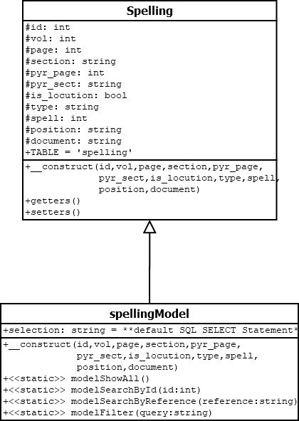
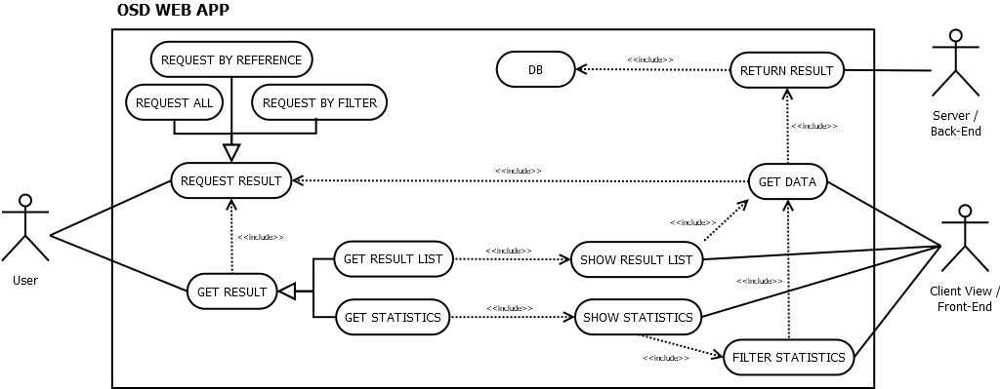
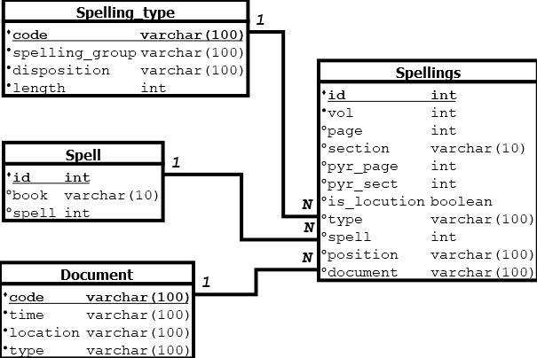

# Diseño

## Funciones en pseudocódigo

### Back-End (Modelo-Visto-Controlador)

#### Modelo:
<pre>
Clase Conexion hereda de PDO
Atributos:
-host : cadena privada
-db : cadena privada
-user : cadena privada
-pass : cadena privada
-dsn : cadena privada

Método constructor:
    Inicializar atributos:
        -dsn: cadena con la conexión a la base de datos
    Intentar:
        -establecer conexión con la base de datos usando el constructor del padre
        -establecer el modo de errores de PDO como modo excepción
    Si ocurre una excepción:
        -mostrar mensaje de error y terminar el script

Clase Spelling
Atributos:
-id : entero protegido
-vol : entero protegido
-page : entero protegido
-section : cadena protegida
-pyr_page : entero protegido
-pyr_sect : cadena protegida
-is_locution : booleano protegido
-type : cadena protegida
-spell : entero protegido
-position : cadena protegida
-document : cadena protegida
-TABLE : constante cadena con valor 'spelling'

Método constructor:
    Inicializar atributos con los valores pasados como parámetros

Métodos GET y SET para cada atributo

Clase SpellingModel hereda de Spelling
Método constructor:
Llamar al constructor de la clase padre con los valores pasados como parámetros

Constante cadena 'selection' con la consulta SQL a realizar en la base de datos

Método estático 'modelShowAll':
    Crear objeto de la clase Conexion
    Intentar:
        -preparar consulta SQL utilizando la constante 'selection' y ordenar los resultados por id
        -ejecutar consulta SQL
    Si ocurre una excepción:
        -mostrar mensaje de error
    Devolver los resultados de la consulta SQL

Método estático 'modelSearchById' con un parámetro:
    Crear objeto de la clase Conexion
    Intentar:
        -preparar consulta SQL utilizando la constante 'selection', filtrando por el id pasado como parámetro
        -ejecutar consulta SQL
    Si ocurre una excepción:
        -mostrar mensaje de error
    Devolver los resultados de la consulta SQL

Método estático 'modelSearchByReference' con un parámetro:
    Método estático 'modelSearchByReference' con un parámetro 'reference':
    Crear objeto de la clase Conexion
    Intentar:
    -establecer valores iniciales para cada variable de búsqueda
    -si el primer carácter de 'reference[0]' no es nulo, asignar su valor a la variable 'vol' y modificar 'orVol' en    consecuencia
    -si el primer carácter de 'reference[1]' no es nulo, asignar su valor a la variable 'page' y modificar 'orPage' en  consecuencia
    -si el primer carácter de 'reference[2]' no es nulo, asignar su valor a la variable 'section' y modificar 'orSection' en    consecuencia
    -si el primer carácter de 'reference[3]' no es nulo, asignar su valor a la variable 'pyr_page' y modificar 'orPyr_Page'en consecuencia
    -si el primer carácter de 'reference[4]' no es nulo, asignar su valor a la variable 'pyr_sect' y modificar 'orPyr_Sect'en consecuencia
    -preparar consulta SQL utilizando la constante 'selection', filtrando por los valores de búsqueda y operadores lógicos  'OR' necesarios
    -enlazar valores de las variables de búsqueda a los parámetros de la consulta SQL
    -ejecutar consulta SQL
    Si ocurre una excepción:
    -mostrar mensaje de error
    Devolver los resultados de la consulta SQL

Método estático 'modelFilter' con un parámetro 'query':
    Crear objeto de la clase Conexion
    Intentar:
        -preparar consulta SQL utilizando la constante 'selection' y el parámetro 'query'
        -ejecutar consulta SQL
    Si ocurre una excepción:
        -mostrar mensaje de error
    Devolver los resultados de la consulta SQL

</pre>

#### Vista:
<pre>
Metodo 'show' con un parámetro 'array':
    Crear una matriz vacía llamada 'data'.
    Por cada valor en 'array', agregar un nuevo elemento en la matriz 'data' con la estructura de JSON.
    Convertir la matriz 'data' en un objeto JSON y guardarlo en la variable 'datajson'.
    Devolver 'datajson'.

Metodo 'encodeReference' con parámetros 'vol, page, section, pyr_page, pyr_sect':
    Crear una variable llamada 'code' con el valor "CT " seguido del valor de 'vol' y 'page' separados por un espacio.
    Si 'section' no es nulo, agregar su valor a 'code' separado por un espacio.
    Crear una variable 'codeSect' con el valor de 'code'.
    Si 'pyr_sect' no es nulo, agregar a 'code' el valor de 'pyr_page', seguido de un espacio, y el valor de 'pyr_sect' entre paréntesis.
    Si 'pyr_page' no es nulo pero 'pyr_sect' sí lo es, agregar a 'code' el valor de 'pyr_page' entre paréntesis.
    Convertir 'code' a una cadena y devolverla.

Metodo 'referenceToArray' con un parámetro 'reference':
    Convierte el texto de referencia en mayúsculas.
    Crea un conjunto de variables para almacenar los diferentes valores que se extraerán de la referencia.
    Divide la referencia en dos partes, una que contiene información de volumen, página y sección, y otra que contiene información adicional (si existe).
    Analiza la primera parte de la referencia y extrae los valores de volumen, página y sección.
    Si existe una segunda parte de la referencia, analiza esta parte y extrae los valores de pyr page y pyr section.
    Crea un array que contiene los valores extraídos de la referencia y lo devuelve.
</pre>

#### Controlador:
<pre>
Si se pide 'showAll':
    Se inicia un spelling del modelo Show All.
    Se recorre y se mete en un array
    Se muestra con el método show().

Si se pide 'search':
    Se inicia un spelling del modelo searchById, con el parametro del id.
    Se recorre y se mete en un array
    Se muestra con el método show().

Si se pide 'filter':
    Se inicia un spelling del modelo filter, con el parametro en el que se envia un string con un modelo SQL (WHERE...).
    Se recorre y se mete en un array
    Se muestra con el método show().

Si se pide 'quickSearch':
    Se inicia un spelling del modelo modelSearchByRefence, con el parametro en el que se envia un string con una referencia.
    Se recibe y se una referencia que se modifica con referenceToArray(reference).
    Si no existe la referencia se devolverá un mensaje de error.
    Si existe, se recorre y se mete en un array
    Se muestra con el método show().
</pre>

### Front-End

<pre>
index:
    Importa los scripts, css y librerías externas alojadas localmente (ajax-xlsx, bootstrap, chart.js, datatables, jquery).
    Carga el layout.

layout:
    Establece la estructura estática de la aplicación con un navbar, un contenedor principal, una barra lateral y un footer.
    Carga el navbar.
    Establece la lógica de comportamiento de la barra lateral: cuando se pulsa cada boton se desplegará un contenedor de izquierda a derecha mediante una transición. Al pulsar en otro, se desplegará mientras se esconde el resto. En caso de pulsar cualquier botón, se esconderán.

navbar:
    Permite navegar entre las secciones home, locations, project, sources y spelling.

views:
    La pantalla por defecto es home y muestra una pantalla de bienvenida por defecto. En caso de pulsar cualquier botón de búsquedo dejará paso a un spinner mientras espera a cargar los resultados que lo substituyan.
    El resto de pantallas son estáticas e informativas. "Spellings" recibirá los datos de la base de datos y los mostrará como cards.

busquedas:
    El botón "all" devolverá todos los resultados contenidos en la base de datos.
    El botón "search" desplegará un input que permitirá buscar por referencia según el código empleado en los volúmenes de de Buck y Allen.
    El botón "filter" desplegará un filtro que permitirá seleccionar los resultados según sus características.

filter:
    Tendrá 6 secciones diferenciadas (Spelling, Spells, Documents, Time, Location, Reference).
    El resultado de la selección será un string con el formato de SQL query.
    "Spelling" permitirá discriminar entre si es la locución  wsir NN pn/tn o wsir dios mediante botones que funcionarán como checkbox. También se muestran todas las grafías que se seleccionarán o deseleccionarán del mismo modo. Se puden filtrar con un botón de seleccionar/deseleccionar todos, un selector de grupo, de disposición y de numero de signos. Se comprobarán los resultados y si contienen la clase "active", se añadirán al filtro.
    "Spells" permitirá, con el mismo sistema de botones checkbox, seleccionar entre PT y CT. También se permitirá seleccionar formulas especificas o rangos mediante un input. Estos se renderizarán en pantalla y serán leidos por el script para introducirlos dentro del string.
    "Documents" usará el mismo sistema que las grafías pero en el selector se podrá filtrar por tipología de documento. Más abajo, con el mismo sistema se seleccionará la posición ("positions") dentro del documento. Ambos contarán con el botón de seleccionar/deseleccionar todos funcionando de modo independiente.
    "Time" usará el mismo sistema que las grafías pero será importante adaptar los botones a un formato que se reconozca como una linea de tiempo mediante un grid. Contará con el botón de seleccionar/deseleccionar todos.
    "Location" será idéntico a la sección "positions", pero con los valor de localización geográficas.
    "Reference" usará el mismo sistema de inputs que "spells" aplicado al volume, page, section, pyr_page, pyr_section
    Salvo el caso de "location", el resto de botones checkbox serán generados automáticamente mediante peticiones a la base de datos.
    El botón "Filter", situado debajo a la derecha, permitirá realizar la búsqueda.

table:
    Se accederá a la tabla tras hacer una búsqueda en el contenedor principal bajo la pestaña seleccionada (table o charts).
    Los datos obtenidos se renderizarán mediante ajax en un tabla.
    Se renderizará en el home.
    La tabla será configurada mediante la librería datatables para permitir el paginado, ordenación, busquedas rápidas, descarga en excel e impresion de documentos.
    Al pulsar sobre una fila, se renderizarán en detalle los datos de la grafía seleccionada mediante un modal de bootstrap (la información se obtendrá mediante una petición a la base de datos tras obtener el id de la grafía).

charts:
    Se accederá a las graficas tras hacer una búsqueda en el contenedor principal bajo la pestaña seleccionada (table o charts).
    Los datos obtenidos se guardarán en un objeto temporal mediante ajax.
    El objeto guardará una serie de arrays con la referencia y un numero de coincidencias que se irá incrementando a medida que se leen los resutados.
    Los datos serán renderizados en canvas mediante la librería "chart.js".
    Mediante botones se seleccionará entre las características principales (MdC, Locution/god, spelling groups, signs, sign disposition, sign length, books, spells, documents, types, positions, locations, time). Cuando uno se renderice, los demás pasarán a "hidden". Por defecto se mostrará locution/god.
    Mediante la configuración de la librería (y asistido por js y jquery) se podrá cambiar de tipo de gráfica (barras o pie), se podrá modificar el color a escala de grises y se podrá descargar un png de la gráfica.
</pre>

    

## Diagrama de Clases

## Diagrama de Casos de Uso

## Guia de estilos, wireframe y Mock

La guia de estilos, framework y Mock han sido creados con la herramienta de desarrollo de prototipos web, Figma. Se podrá consultar libremente a partir del siguiente enlace:  
https://www.figma.com/file/DCCuFJQl6GVBQc3YPjWKBE/OSS?type=design&node-id=0-1&mode=design&t=CZf1KrphBaCCHsMa-0

## Diagrama de Bases de Datos.

#### _Explicación del modelo de datos:_
La tabla principal de la base de datos es **Spellings** (grafías), cuyo contenido es el siguiente:
- id: valor primario y único.
- vol: corresponde al volúmen de los libros de de Buck y Allen.
- page: página de los libros (puede ser null debido al formato de los documentos).
- section: sección de la página (null del mismo modo que el anterior).
- pyr_page: referencia que corresponde a la estructura de los PT (incluidos en el vol. VIII) y que no se corresponde a la página del documento. En los volúmenes previos al VIII, lo normal será null.
- pyr_sect: sección dentro de la referencia anterior.
- is_locution: si la referencia se corresponde al nombre del dios Osiris (false / 0) o a la locución _wsir NN pn/tn_ (true / 1).
- type: el spelling se asocia a una referencia del MdC. Esto no permite confusión ya que incluye cada signo y su posición en dicho código.
- spell: referencia al id de la fórmula religiosa correspondiente.
- position: localización de la grafía en el documento según convención egiptológica:
    - Head = H
    - Foot = F
    - Back = B
    - Top = L
    - Front = Fr
    - Bottom = Bo
    - Side = S
    - Others(example: canoptic box) = X
    - Fragments and unknowns = 'unknown'
- document: codigo del documento de acuerdo a las convenciones egiptológicas (ej. **B1L** = Necrópolis de **B**ersha, Sarcófago **1**, conservado en **L**ondres).

 

La tabla **Spelling_type** (tipo de grafía) recoge la totalidad de variaciones de las grafías en referencias individuales. Cada variación puede repetirse en un numero indeterminado de veces, por lo que tendrá una referencia 1 a N con _Spellings.type_. Cuenta con los siguiente atributos:
- code: referencia única y clave primaria en forma del código de MdC.
- spelling_group: grupo general en el que clasificamos la variación (ej.: flesh-mouth = cuenta con el signo de la carne y la boca).
- disposition: disposición de la variación (ej.: vertical).
- length: numero de signos.

 

La tabla **Spell** ("hechizo", "fórmula"...) recoge el libro y la fórmula o sección dentro del contexto de los textos religiosos en los que se encuadra la grafía. Varias grafías pueden presentarse en el mismo contexto, por lo que tendrá una referencia 1 a N con _Spellings.spell_. Cuenta con los siguiente atributos:
- id: valor primario y único.
- book: texto religioso en el que se encuentra (PT o CT).
- spell: fórmula religiosa.

 

La tabla **Document** (documento) se recoge el código del documento y sus características.Varias grafías pueden presentarse en el mismo documentoo, por lo que tendrá una referencia 1 a N con _Spellings.document_. Cuenta con los siguiente atributos:
- code: valor primario y único. Vease _Spellings.document_.
- time: periodo en el que se encuadra el documento. Si no se conoce, se seguirá la convención egiptológica y se le asignará el carater "?".
- location: localización original del documento. La convención en caso de ser desconocida es como la anterior.
- type: tipo de documento (coffin, tomb, board...).
